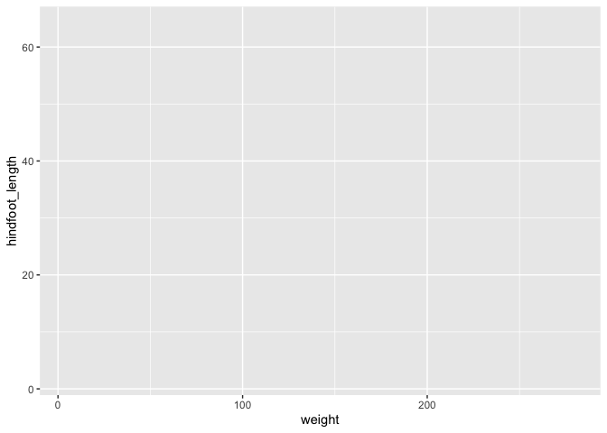
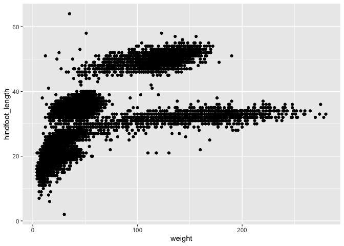
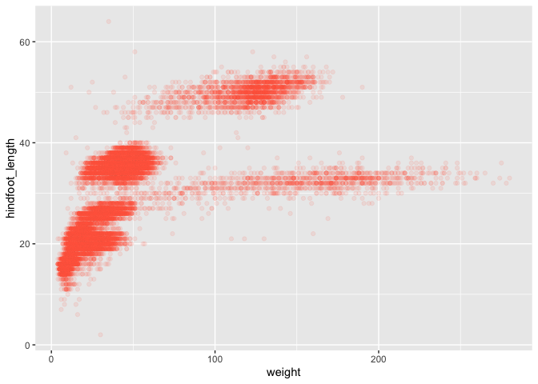
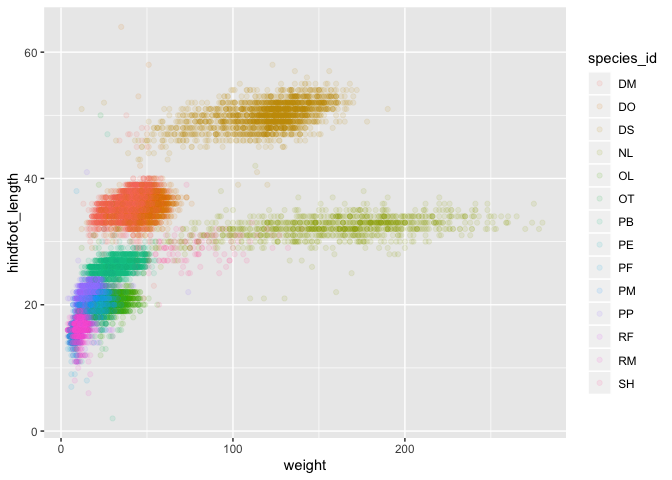
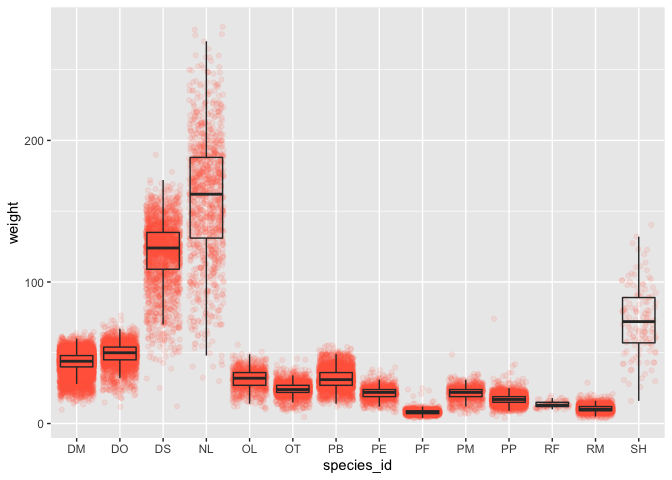
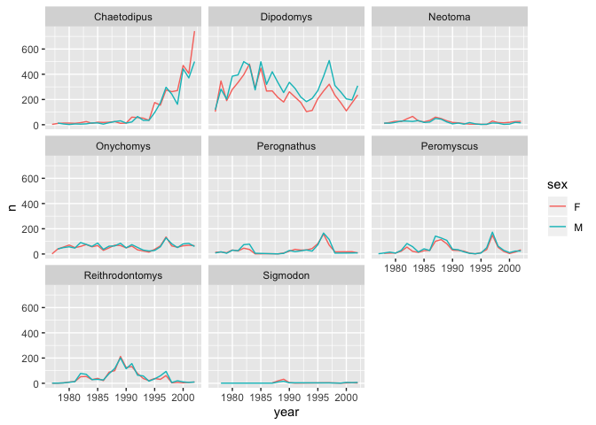
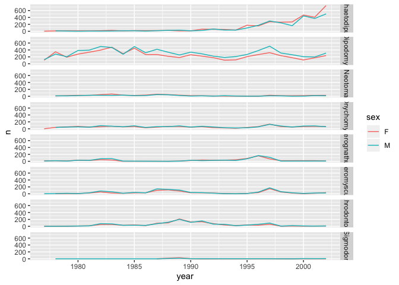
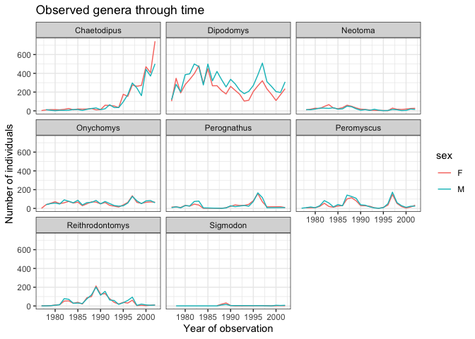
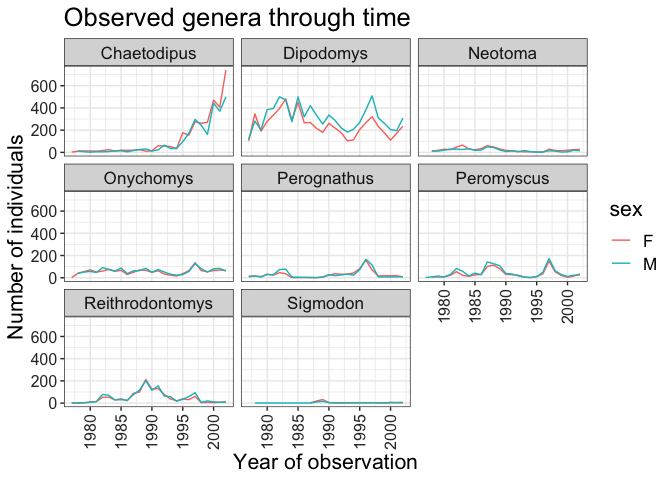

Data is beautiful part 2 - visualizations with ggplot2: R series
================

**4thMeeting - Saturday, January 12, 2020**

**Tutors and Organizers:**

  - Pande Putu Erawijantari
  - Felix Salim
  - Mia Fitria Utami

## Content:

  - Introductions of
        `ggplot2`
    
    sources:
    
      - <https://hbctraining.github.io/Training-modules/Visualization_in_R/lessons/02_basics_ggplot2.html>
      - <https://hbctraining.github.io/Training-modules/Visualization_in_R/lessons/basic_plots_in_r.html>
      - <https://tutorials.iq.harvard.edu/R/Rgraphics/Rgraphics.html>

  - Data Visualization
        session:
    
    source:
    
      - <https://datacarpentry.org/R-ecology-lesson/04-visualization-ggplot2.html>

  - Data:

source: <https://ndownloader.figshare.com/files/2292169>

Execute the command below if you miss the previous meeting.

    dir.create("data_raw")
    
    download.file(url="https://ndownloader.figshare.com/files/2292169",
                  destfile = "data_raw/portal_data_joined.csv")

### Introductions of `ggplot2`

Visualizations could help us to gain more insight when we are working
with large sets of numbers. On the first meeting, we tried some basic
plots in **R**. You can always comeback to the
[1stNotes](https://github.com/erawijantari/RPyId/blob/master/Notes/20191109_RPyID1st/Hands-on_Inflamation_Swc.ipynb)
or explore more
[here](https://hbctraining.github.io/Training-modules/Visualization_in_R/lessons/basic_plots_in_r.html).
Recently, R users have moved away from base graphic options to
[ggplot2](https://www.r-graph-gallery.com/ggplot2-package.html) with
more functionality compared to the base R ploting.

**Why `ggplot2`?**

    + consistent underlying grammar of graphics (Wilkinson, 2005)
    + plot specification at a high level of abstraction
    + very flexible
    + theme system for polishing plot appearance
    + mature and complete graphics system
    + many users, active mailing list

**Not typical `ggplot2` ussage**

    - 3-dimensional graphics (see the rgl package)
    - Graph-theory type graphs (nodes/edges layout; see the igraph package)
    - Interactive graphics (see the ggvis package)

`ggplot2` are already installed under the **Tidyverse** that we have
used on the previous meeting. Below is the reminder for installations
for those who may missed the previous meeting:

`install.packages("tidyverse")`

`ggplot2` functions like data in the *long* format, i.e., a column for
every dimension, and a row for every observation. `ggplot2` graphics are
built step by step by adding new elements. Adding layers in this fashion
allows for extensive flexibility and customization of plots.

### Data Visualizations session

ref:
<https://datacarpentry.org/R-ecology-lesson/04-visualization-ggplot2.html>

Today’s session will cover the basic of `ggplot2` visualizations. If you
want know more you can explore again after this session.

#### Data Preparations

In preparations for the visualizations, we need a cleaned up version of
the data set that does not include any missing data.

1.  Let’s start by removing observations of animals for which weight and
    hindfoot\_length are missing, or the sex has not been
    determined:

<!-- end list -->

``` r
library(tidyverse)
```

    ## ── Attaching packages ──────────────────────────────────────────────── tidyverse 1.3.0 ──

    ## ✓ ggplot2 3.2.1     ✓ purrr   0.3.3
    ## ✓ tibble  2.1.3     ✓ dplyr   0.8.3
    ## ✓ tidyr   1.0.0     ✓ stringr 1.4.0
    ## ✓ readr   1.3.1     ✓ forcats 0.4.0

    ## ── Conflicts ─────────────────────────────────────────────────── tidyverse_conflicts() ──
    ## x dplyr::filter() masks stats::filter()
    ## x dplyr::lag()    masks stats::lag()

``` r
surveys <- read_csv("data_raw/portal_data_joined.csv")
```

    ## Parsed with column specification:
    ## cols(
    ##   record_id = col_double(),
    ##   month = col_double(),
    ##   day = col_double(),
    ##   year = col_double(),
    ##   plot_id = col_double(),
    ##   species_id = col_character(),
    ##   sex = col_character(),
    ##   hindfoot_length = col_double(),
    ##   weight = col_double(),
    ##   genus = col_character(),
    ##   species = col_character(),
    ##   taxa = col_character(),
    ##   plot_type = col_character()
    ## )

``` r
surveys_complete <- surveys %>%
  filter(!is.na(weight),           # remove missing weight
         !is.na(hindfoot_length),  # remove missing hindfoot_length
         !is.na(sex))                # remove missing sex
```

2.  We are also going to remove observations for rare species (i.e.,
    that have been observed less than 50 times). We will do this in two
    steps: first we are going to create a data set that counts how often
    each species has been observed, and filter out the rare species;
    then, we will extract only the observations for these more common
    species:

<!-- end list -->

``` r
## Extract the most common species_id
species_counts <- surveys_complete %>%
    count(species_id) %>% 
    filter(n >= 50)

## Only keep the most common species
surveys_complete <- surveys_complete %>%
  filter(species_id %in% species_counts$species_id)
```

3.  check that surveys\_complete has 30463 rows and 13 columns by typing
    dim(surveys\_complete).

<!-- end list -->

``` r
dim(surveys_complete)
```

    ## [1] 30463    13

4.  Export the cleaned data into CSV files, and save in `data_raw`
    folder.

<!-- end list -->

``` r
write_csv(surveys_complete, path = "data_raw/surveys_complete.csv")
```

#### Plotting with ggplot2

To build a ggplot, we will use the following basic template that can be
used for different types of plots:

`ggplot(data = <DATA>, mapping = aes(<MAPPINGS>)) + <GEOM_FUNCTION>()`

Before ploting, let’s load the data that we have prepared.

``` r
surveys_complete <- read_csv("data_raw/surveys_complete.csv")
```

    ## Parsed with column specification:
    ## cols(
    ##   record_id = col_double(),
    ##   month = col_double(),
    ##   day = col_double(),
    ##   year = col_double(),
    ##   plot_id = col_double(),
    ##   species_id = col_character(),
    ##   sex = col_character(),
    ##   hindfoot_length = col_double(),
    ##   weight = col_double(),
    ##   genus = col_character(),
    ##   species = col_character(),
    ##   taxa = col_character(),
    ##   plot_type = col_character()
    ## )

1.  **Let’s use the `ggplot()` function** to bind the plot to a specific
    data frame using the `data` argument.

<!-- end list -->

``` r
ggplot(data = surveys_complete)
```

<!-- -->

2.  **define a mapping (using the aesthetic (aes) function)**, by
    selecting the variables to be plotted and specifying how to present
    them in the graph, e.g. as x/y positions or characteristics such as
    size, shape, color,
etc.

<!-- end list -->

``` r
ggplot(data = surveys_complete, mapping = aes(x = weight, y = hindfoot_length))
```

<!-- -->

3.  **add `geoms`** – graphical representations of the data in the plot
    (points, lines, bars). `ggplot2` offers many different `geoms`; we
    will use some common ones today, including:

>   - `geom_point()` for scatter plots, dot plots, etc.
>   - `geom_boxplot()` for, boxplots.
>   - `geom_line()` for trend lines, time series, etc.
>   - `geom_tile()` or `geom_raster()`\* for heatmaps (although not
>     really recommended, see explanations below)

To add a geom to the plot use the **+** operator. Because we have two
continuous variables, let’s use geom\_point()
first:

``` r
ggplot(data = surveys_complete, mapping = aes(x = weight, y = hindfoot_length)) +
  geom_point()
```

<!-- -->

The + in the ggplot2 package is particularly useful because it allows
you to modify existing ggplot objects. This means you can easily set up
plot templates and conveniently explore different types of plots, so the
above plot can also be generated with code like this:

    # Assign plot to a variable
    surveys_plot <- ggplot(data = surveys_complete, 
                           mapping = aes(x = weight, y = hindfoot_length))
    
    # Draw the plot
    surveys_plot + 
        geom_point()

**Notes**

>   - Anything you put in the ggplot() function can be seen by any geom
>     layers that you add (i.e., these are universal plot settings).
>     This includes the x- and y-axis mapping you set up in aes().
>   - You can also specify mappings for a given geom independently of
>     the mappings defined globally in the ggplot() function.
>   - The + sign used to add new layers must be placed at the end of the
>     line containing the previous layer. If, instead, the + sign is
>     added at the beginning of the line containing the new layer,
>     ggplot2 will not add the new layer and will return an error
>     message.

#### Building your plots iteratively

Building plots with ggplot2 is typically an iterative process. We start
by defining the dataset we’ll use, lay out the axes, and choose a geom:

From our first trial, we may want to modify the plot for easier
intepretation. For example, we can add transparency `(alpha)` to avoid
overplotting and put `color` to all
points:

``` r
ggplot(data = surveys_complete, mapping = aes(x = weight, y = hindfoot_length)) +
    geom_point(alpha = 0.1, color = "tomato")
```

<!-- -->

We also can color each point based on the species\_id. We could use a
vector as an input to the argument **color**. `ggplot2` will provide a
different color corresponding to different values in the vector. Here is
an example where we color with
`species_id`:

``` r
ggplot(data = surveys_complete, mapping = aes(x = weight, y = hindfoot_length)) +
    geom_point(alpha = 0.1, aes(color = species_id))
```

<!-- -->

Or we can also specify the colors directly inside the mapping provided
in the ggplot() function. This will be seen by any geom layers and the
mapping will be determined by the x- and y-axis set up in
aes().

``` r
ggplot(data = surveys_complete, mapping = aes(x = weight, y = hindfoot_length, color = species_id)) +
    geom_point(alpha = 0.1)
```

<!-- -->

#### Boxplot

We can use boxplots to visualize the distribution of weight within each
species:

``` r
ggplot(data = surveys_complete, mapping = aes(x = species_id, y = weight)) +
    geom_boxplot()
```

<!-- -->

By adding points to boxplot, we can have a better idea of the number of
measurements and of their
distribution:

``` r
ggplot(data = surveys_complete, mapping = aes(x = species_id, y = weight)) +
  geom_jitter(alpha = 0.1, color = "tomato") +
   geom_boxplot(alpha = 0)
```

<!-- -->

Let’s try to color the group based on the sex
informations.

``` r
ggplot(data = surveys_complete, mapping = aes(x = species_id, y = weight, fill=sex)) +
    geom_boxplot()
```

<!-- -->

**Challenges 1 (20 min)**

> 1.  To see the shape of distributions, replace the boxplot with a
>     violin plot; see `geom_violin()`.
> 2.  Sometimes, we need to change the scale for easier observations.
>     Try to represent the weight on the log10 scale; see
>     `scale_y_log10()`.
> 3.  Create a boxplot for `hindfoot_length` and overlay the boxplot
>     with jitter for actual measurements
> 4.  Add color for each data point based on which plot the sample was
>     taken (`plot_id`)

#### Plotting time series data

Let’s calculate number of counts per year for each genus. First we need
to group the data and count records within each group:

``` r
yearly_counts <- surveys_complete %>%
  count(year, genus)
```

Time series data can be visualized as a line plot with years on the x
axis and counts on the y axis:

``` r
ggplot(data = yearly_counts, mapping = aes(x = year, y = n)) +
     geom_line()
```

<!-- -->

Oh, no we need to tell ggplot to draw a line for each genus by modifying
the aesthetic function to include group =
genus:

``` r
ggplot(data = yearly_counts, mapping = aes(x = year, y = n, group = genus)) +
    geom_line()
```

<!-- -->

Much better, we will be able to distinguish genera in the plot if we add
colors (using color also automatically groups the
data):

``` r
ggplot(data = yearly_counts, mapping = aes(x = year, y = n, color = genus)) +
    geom_line()
```

<!-- -->

#### Heatmap

**Heatmap** is a graphical representations of data where the individual
values contained in a matrix are represented as colors.

Let’s try to represent the genus counts in different `plot_type` during
the 2002 sampling periode (we will exclude the Spectab exclosure for
simplicity, because the genus *Sigmodon* were not recorded in that
particular plot\_type).

``` r
#prepare the tables needed for visualizations
dist2002 <- surveys_complete %>% 
  filter(year == 2002, plot_type != "Spectab exclosure") %>%
  count(genus, plot_type)
```

We will use `geom_raster()` to make the heatmaps.

``` r
#generate the heatmap
ggplot(data=dist2002, aes(x=plot_type, y=genus))+
  geom_raster(aes(fill = n))
```

<!-- -->

For small scale data, this heatmap still quite understandable. However,
when we are working with bigger data scale, we may want your heatmap to
cluster nicely, posibly with the dendogram to see their trend of
clustering.

Unfortunatelly, there is no direct functions to cluster the heatmap
using ggplot and most of the R user **do not recommend** using ggplot
for heatmap.

It is possible to create cluster heatmap using the ggplot but it
involves manual clustering and ordering, before pass the data into
ggplot. You can see the example of doing so, in the link below.

  - <http://swarchal.github.io/pages/2015/11/25/heatmap-ggplot/>

Moreover, dendogram is quite tricky using ggplot.

For that reason, you can try to use another R packages to create
heatmaps as explained
    below.

  - <https://www.datanovia.com/en/lessons/heatmap-in-r-static-and-interactive-visualization/>
  - <https://jokergoo.github.io/ComplexHeatmap-reference/book/>

Don’t worry, we will come back to do proper heatmap in the next meeting.

#### Faceting

Faceting allows the user to split one plot into multiple plots based on
a factor included in the dataset.

There are two types of facet functions:

  - `facet_wrap()` arranges a one-dimensional sequence of panels to
    allow them to cleanly fit on one page.
  - `facet_grid()` allows you to form a matrix of rows and columns of
    panels.

Both geometries allow to to specify faceting variables specified within
vars(). For example:

`facet_wrap(facets = vars(facet_variable))` or `facet_grid(rows =
vars(row_variable), cols = vars(col_variable))`.

Let’s start by using facet\_wrap() to make a time series plot for each
species:

``` r
ggplot(data = yearly_counts, mapping = aes(x = year, y = n)) +
    geom_line() +
    facet_wrap(facets = vars(genus))
```

<!-- -->

Now, we would like to split the line in each plot by the sex of each
individual measured. To do that we need to make counts in the data frame
grouped by year, species\_id, and sex:

``` r
# split the needed data
yearly_sex_counts <- surveys_complete %>%
  count(year, genus, sex)

# plot faceted plot by splitting further by sex using color

ggplot(data = yearly_sex_counts, mapping = aes(x = year, y = n, color = sex)) +
  geom_line() +
  facet_wrap(facets =  vars(genus))
```

<!-- -->

Now let’s use facet\_grid() to control how panels are organised by both
rows and columns:

``` r
ggplot(data = yearly_sex_counts, 
       mapping = aes(x = year, y = n, color = sex)) +
  geom_line() +
  facet_grid(rows = vars(sex), cols =  vars(genus))
```

<!-- -->

You can also organise the panels only by rows (or only by columns):

``` r
# One column, facet by rows
ggplot(data = yearly_sex_counts, 
       mapping = aes(x = year, y = n, color = sex)) +
  geom_line() +
  facet_grid(rows = vars(genus))
```

<!-- -->

``` r
# One row, facet by column
ggplot(data = yearly_sex_counts, 
       mapping = aes(x = year, y = n, color = sex)) +
  geom_line() +
  facet_grid(cols = vars(genus))
```

<!-- -->

#### `ggplot2` themes

Every single component of a ggplot graph can be customized using the
generic `theme()` function. For example, we can change our previous
graph to have a simpler white background using the `theme_bw()`
function:

``` r
 ggplot(data = yearly_sex_counts, 
        mapping = aes(x = year, y = n, color = sex)) +
     geom_line() +
     facet_wrap(vars(genus)) +
     theme_bw()
```

<!-- -->

The complete list of ggplot themes is available at
<https://ggplot2.tidyverse.org/reference/ggtheme.html>. The [ggplot2
extensions website](https://www.ggplot2-exts.org/) provides a list of
packages that extend the capabilities of ggplot2, including additional
themes.

**Challenges 2 (10 min)**

> Use what you just learned to create a plot that depicts how the
> average weight of each species changes through the years.

#### Customization

We can improve the plot by numerous customizations listed in the
[ggplot2 cheat
sheet](https://github.com/rstudio/cheatsheets/raw/master/data-visualization-2.1.pdf).
Several [color
palettes](https://cran.r-project.org/web/packages/ggsci/vignettes/ggsci.html)
also available for neat visualizations for publications.

Now, let’s change names of axes to something more informative than
‘year’ and ‘n’ and add a title to the
figure:

``` r
ggplot(data = yearly_sex_counts, mapping = aes(x = year, y = n, color = sex)) +
    geom_line() +
    facet_wrap(vars(genus)) +
    labs(title = "Observed genera through time",
         x = "Year of observation",
         y = "Number of individuals") +
    theme_bw()
```

<!-- -->

The axes have more informative names, but their readability can be
improved by increasing the font size. This can be done with the generic
theme()
function:

``` r
ggplot(data = yearly_sex_counts, mapping = aes(x = year, y = n, color = sex)) +
    geom_line() +
    facet_wrap(vars(genus)) +
    labs(title = "Observed genera through time",
        x = "Year of observation",
        y = "Number of individuals") +
    theme_bw() +
    theme(text=element_text(size = 16))
```

<!-- -->

After our manipulations, you may notice that the values on the x-axis
are still not properly readable. Let’s change the orientation of the
labels and adjust them vertically and horizontally so they don’t
overlap. You can use a 90-degree angle, or experiment to find the
appropriate angle for diagonally oriented
labels:

``` r
ggplot(data = yearly_sex_counts, mapping = aes(x = year, y = n, color = sex)) +
    geom_line() +
    facet_wrap(vars(genus)) +
    labs(title = "Observed genera through time",
        x = "Year of observation",
        y = "Number of individuals") +
    theme_bw() +
    theme(axis.text.x = element_text(colour = "grey20", size = 12, angle = 90, hjust = 0.5, vjust = 0.5),
                        axis.text.y = element_text(colour = "grey20", size = 12),
          text = element_text(size = 16))
```

<!-- -->

If you like the changes you created better than the default theme, you
can save them as an object to be able to easily apply them to other
plots you may create:

``` r
# define custom theme
grey_theme <- theme(axis.text.x = element_text(colour = "grey20", size = 12, angle = 90, hjust = 0.5, vjust = 0.5),
                          axis.text.y = element_text(colour = "grey20", size = 12),
                          text = element_text(size = 16))

# create a boxplot with the new theme
ggplot(surveys_complete, aes(x = species_id, y = hindfoot_length)) +
    geom_boxplot() +
    grey_theme
```

<!-- -->

#### Arranging and explorting plots

Faceting is a great tool for splitting one plot into multiple plots, but
sometimes you may want to produce a single figure that contains multiple
plots using different variables or even different data frames. The
gridExtra package allows us to combine separate ggplots into a single
figure using grid.arrange():

`install.packages("gridExtra")`

``` r
library(gridExtra)
```

    ## 
    ## Attaching package: 'gridExtra'

    ## The following object is masked from 'package:dplyr':
    ## 
    ##     combine

``` r
spp_weight_boxplot <- ggplot(data = surveys_complete, 
                             mapping = aes(x = genus, y = weight)) +
  geom_boxplot() +
  scale_y_log10() +
  labs(x = "Genus", y = "Weight (g)") +
  theme(axis.text.x = element_text(angle = 45, hjust = 1))

spp_count_plot <- ggplot(data = yearly_counts, 
                         mapping = aes(x = year, y = n, color = genus)) +
  geom_line() + 
  labs(x = "Year", y = "Abundance")

grid.arrange(spp_weight_boxplot, spp_count_plot, ncol = 2, widths = c(4, 6))
```

<!-- -->

More complex layout are also available
[here](https://cran.r-project.org/web/packages/gridExtra/vignettes/arrangeGrob.html).
After creating your plot, you can save it to a file in your favorite
format. The Export tab in the Plot pane in RStudio will save your plots
at low resolution, which will not be accepted by many journals and will
not scale well for posters.

Instead, use the ggsave() function, which allows you easily change the
dimension and resolution of your plot by adjusting the appropriate
arguments (width, height and dpi).

Make sure you have the fig/ folder in your working directory.

You can use this command to create a folder. `dir.create("fig")`

``` r
my_plot <- ggplot(data = yearly_sex_counts, 
                  mapping = aes(x = year, y = n, color = sex)) +
    geom_line() +
    facet_wrap(vars(genus)) +
    labs(title = "Observed genera through time",
        x = "Year of observation",
        y = "Number of individuals") +
    theme_bw() +
    theme(axis.text.x = element_text(colour = "grey20", size = 12, angle = 90, hjust = 0.5, vjust = 0.5),
                        axis.text.y = element_text(colour = "grey20", size = 12),
          text=element_text(size = 16))
ggsave("fig/yearly_sex_counts.png", my_plot, width = 15, height = 10)

# This also works for grid.arrange() plots
combo_plot <- grid.arrange(spp_weight_boxplot, spp_count_plot, ncol = 2, widths = c(4, 6))
```

<!-- -->

``` r
ggsave("fig/combo_plot_abun_weight.png", combo_plot, width = 10, dpi = 300)
```

    ## Saving 10 x 5 in image

## More exercise

See notebooks
    here:

  - <https://www.kaggle.com/rtatman/getting-started-in-r-load-data-into-r>.
  - <https://tutorials.iq.harvard.edu/R/Rgraphics/Rgraphics.html>

## More datasets, more challenge

  - Pokemon Dataset :
    <https://www.kaggle.com/rounakbanik/pokemon/discussion>
  - House Price:
    <https://www.kaggle.com/c/house-prices-advanced-regression-techniques>

## Further Reading

  - The core of R (deep understanding how R work):
    <https://adv-r.hadley.nz/>
  - R for Data Science: <https://r4ds.had.co.nz/>
  - Another source for R for Data Science:
    <https://livebook.datascienceheroes.com/>
  - Rmarkdown for reproducible documentation:
    <https://bookdown.org/yihui/rmarkdown/>
  - R graph cookbook: <https://r-graphics.org/>
  - Feeling gig for Regex (regular expression):
    <http://www.grymoire.com/Unix/Regular.html>
