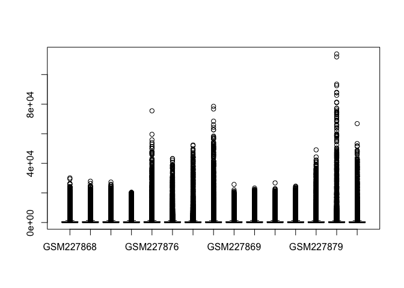
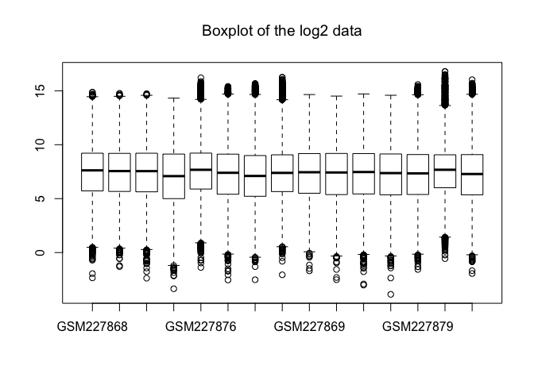
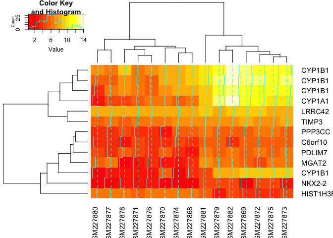
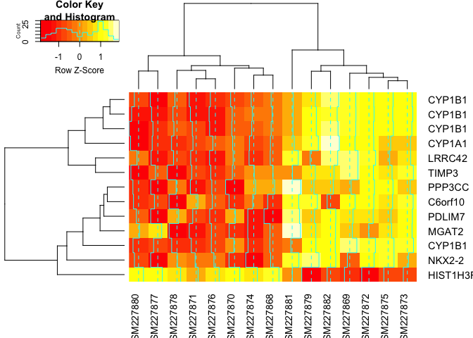

5thMeeting- Basic Statistical Inference with R : R series
================

**5thMeeting - Saturday, February 1, 2020**

**Tutors and Organizers:**

  - Pande Putu Erawijantari
  - Felix Salim
  - Mia Fitria Utami

## Content:

Disclaimer: The content of today’s sessions will cover more on practical
part e.g introductions of statistical functions built into R. The
excercise during the **Hands-on** was selected to give a simple example.
More complex case may need different ways/steps to solve. Please try the
**More exercise** for other examples.

  - Key Terms on Statistics
  - Hypothesis Testing
  - More analysis in R
  - Hands-on source: <https://rpubs.com/idaios/microarrays>
        dataset:
      - [GDS3309](https://www.ncbi.nlm.nih.gov/sites/GDSbrowser?acc=GDS3309)-GEO
        (Gene Expression Omnibus) data:
        <ftp://ftp.ncbi.nlm.nih.gov/geo/datasets/GDS3nnn/GDS3309/soft/GDS3309.soft.gz>

References:

  - <https://psyr.org/probability.html>

  - <http://www.biostathandbook.com/hypothesistesting.html>

  - <http://pluto.huji.ac.il/~msby/StatThink/IntroStat.pdf> (Yakir B,
    2011)

  - <https://learningstatisticswithr.com/lsr-0.6.pdf>

  - <http://pop-gen.eu/wordpress/statistics-in-bioinformatics-using-r>

  - <https://data-flair.training/blogs/t-tests-in-r/>

  - <https://www.datanovia.com/en/courses/comparing-multiple-means-in-r/>

  - <https://rstudio-pubs-static.s3.amazonaws.com/169842_aa602fb45bd64d3fb6c0fa36e49e285a.html>

### Key Terms on Statistics

Statistic is different with probability. Probability theory concerns
about how often different kind of events will happen, given some
assumptions about the world, e. g :

  - What are the chances of a fair coin coming up heads 10 times in a
    row?
  - If I roll two six sided dice, how likely is it that I’ll roll two
    sixes?

Probabilistic questions starts with a known model of the world, and we
can use that model to perform calculations.

Statistical questions work in the other way arround. We usually do not
know the truth about the world. All we have is the data that we want to
learn the truth about the world, e.g:

  - If five cards off the top of the deck are all hearts, how likely is
    it that the deck was shuffled?
  - If the lottery commissioner’s spouse wins the lottery, how likely is
    it that the lottery was rigged?

Below are several key terms in statistic.

  - **Population**: an entire collection of persons, things, or objects
    under study.
  - **Sample**: a portion (or subset) of the larger population under
    study. Selecting the study sample is a crucial step in statictic. We
    have to make sure that the sample can represents the populations.
    The sample must contain the characteristics of the population in
    order to be a representative sample. This will affect the statistic
    **accuracy**.
  - ***Statistic***: a number that is a property of the sample
    e.g. average. The statistic can be used as an estimate of a
    population parameter-a property of the population
  - **Probability**: the mathematical theory used to study uncertainty.
    It provides tools for the formalization and quantification of the
    notion of uncertainty. In particular, it deals with the chance of an
    event occurring.
  - **Hypothesis testing**: the statictical technique to test the
    validity of claim (null hypothesis) by comparing the data you
    observe in your experiment with the predictions of null hypothesis.
  - **Null hypothesis**: The null hypothesis is a statement that you
    want to test. In general, the null hypothesis is that things are the
    same as each other, or the same as a theoretical expectation. After
    you do a hypothesis testing, you are either going to reject or
    accept the null hypothesis. Rejecting the null hypothesis means that
    you conclude that the null hypothesis is not true. The *alternative
    hypothesis* is the one you would believe if the null hypothesis is
    concluded to be untrue.
  - **p-value**: known as calculater probability, the probability of
    finding the onserved, or more extreme, results when the null
    hypothesis of study questions is true.

[**This
capter**](https://bookdown.org/mikemahoney218/IDEAR/basic-statistics-using-r.html)
on [**IDEAR**](https://bookdown.org/mikemahoney218/IDEAR/) book provide
a quick explanations about some definitions, functions in R, and example
that can help us with statistic. Bonus excercise in the end of chapter.

### Hypothesis Testing

Hypothesis testing is an important step, typically the first, in the
process of making inferences. In this step one tries to answer the
question: “Is there a phenomena at all?”. The initial step in
statistical inference in general, and in statistical hypothesis testing
in particular, is the formulation of the statistical model and the
identification of the parameter/s that should be investigated.

After the statistical model has been set, one may split the process of
testing a statistical hypothesis into three steps: (i) formulation of
the hypotheses, (ii) specification of the test, and (iii) reaching the
final conclusion (Yakir B, 2011).

#### Foundations for statistical inference in one parameter

[This
chapter](https://crumplab.github.io/statistics/foundations-for-inference.html)
of the book intuitively explain the foundations of inference, with
example.

##### Statistical inference in sample from one populations

Remember that sample is a subset of populations? Sometimes, we need to
check or estimates the chances that our sample came from particular
populations. One test that can be use to calculate that questions is by
using t-test.

> **In R** syntax: t.test(y,mu=o); which y is the variable of interest
> and mu is the value (mean) described by null hypothesis

*problem example*: Does the volume of a shipment of lumber was less than
usual (mu=37000 cubic feet)

*solutions*:

``` r
set.seed(0)
ship_vol <- c(rnorm(75, mean = 37000, sd = 2500))
t.test(ship_vol, mu = 39000)
```

    ## 
    ##  One Sample t-test
    ## 
    ## data:  ship_vol
    ## t = -7.9555, df = 74, p-value = 1.572e-11
    ## alternative hypothesis: true mean is not equal to 39000
    ## 95 percent confidence interval:
    ##  36417.00 37451.72
    ## sample estimates:
    ## mean of x 
    ##  36934.36

Those showed that the volume of shipment were different from usual. What
is t-value? In one sample test, t-value is the ratio between the
difference of mean (sample mean-population mean) over the standard eror
(sample standard error)

##### Statistical inference in two groups

For two group comparison, the important think that we have to think
first is:

1.  Does the sample draw from independent populations? (For example is
    it before and after case? or treatment and control case?)
2.  How the distributions? is it parametric (follow the normal
    distributions)? or non-parametric? [Read
    this](https://stats.stackexchange.com/questions/132652/how-to-determine-which-distribution-fits-my-data-best)
    for the example.

###### Paired Sample

Paired sample usually come from the “before-after” experiment.

**In R** - parametric: paired t-test

  - syntax: t.test(y1, y2, paired=TRUE); which y1 is the measurement of
    “before” datasets and y2 is the measurement of “after” datasets.

  - non-parametric: The paired samples Wilcoxon test (also known as
    Wilcoxon signed-rank test)

  - syntax: wilcox.test(x, y, paired = TRUE); which x is is the
    measurement of “before” datasets and y is is the measurement of
    “after” datasetets.

  - In two group comparison we can specify the “alternative” which is
    the alternative hypothesis. Allowed value is one of “two.sided”
    (default), “greater” or “less”.

*problem example*: We want to test the new drug that work to reduce the
hypertension. We find 13000 individuals with high systolic blood
pressure (x¯=150 mmHg, SD=10 mmHg) and we provide them with the drug for
a month, and then measure their blood pressure again. Does the blood
preasure different after the drug treatment?

*solutions*:

``` r
#dummy data from https://data-flair.training/blogs/t-tests-in-r/
set.seed(0)
pre_Treatment <- c(rnorm(2000, mean = 150, sd = 10))
post_Treatment <- c(rnorm(2000, mean = 144, sd = 9))
t.test(pre_Treatment, post_Treatment, paired = TRUE)
```

    ## 
    ##  Paired t-test
    ## 
    ## data:  pre_Treatment and post_Treatment
    ## t = 18.301, df = 1999, p-value < 2.2e-16
    ## alternative hypothesis: true difference in means is not equal to 0
    ## 95 percent confidence interval:
    ##  4.891962 6.066220
    ## sample estimates:
    ## mean of the differences 
    ##                5.479091

Again, we see that there is a statistically significant difference in
means of:

t = 20.789, p-value \< 2.2e-16. What is t-value?
[here](https://crumplab.github.io/statistics/t-tests.html#calculate-t)
you can find the thorough explanations.

###### Two independent group

What if the sample that we test are come from independent populations.
We also can use the t-test for calculations. This cuties will help us to
understand about 2 sample T-test (**“Artwork by
@allison\_horst”**).


Remember that, the **Type I** and **Type II** error can occured during
statistical test.

**Type I** error: (**“Artwork by
@allison\_horst”**)


**Type II** error :(**“Artwork by
@allison\_horst”**)


**In R** - parametric: t-test

  - syntax: t.test(y1, y2, paired=FALSE).; which y1 is the group1 and y2
    is the group 2. By default, R assumes that the variances of y1 and
    y2 are unequal, thus defaulting to Welch’s test. To toggle this, we
    use the flag,var.equal=TRUE.

  - non-parametric: Wilcoxon test (also known as Wilcoxon signed-rank
    test)

  - syntax: wilcox.test(x, y, paired = FALSE); which x is group1 and y
    is group 2.

  - In two group comparison we can specify the “alternative” which is
    the alternative hypothesis. Allowed value is one of “two.sided”
    (default), “greater” or “less”.

*problem example*: We will test the hypothesis in which Clevelanders and
New Yorkers spend different amounts for eating outside on a monthly
basis.

*solutions*:

``` r
#dummy data from https://data-flair.training/blogs/t-tests-in-r/
set.seed(0)
Spenders_Cleve <- rnorm(60, mean = 350, sd = 77)
Spenders_NY <- rnorm(60, mean = 400, sd = 80)
t.test(Spenders_Cleve, Spenders_NY, var.equal = TRUE)
```

    ## 
    ##  Two Sample t-test
    ## 
    ## data:  Spenders_Cleve and Spenders_NY
    ## t = -3.994, df = 118, p-value = 0.0001134
    ## alternative hypothesis: true difference in means is not equal to 0
    ## 95 percent confidence interval:
    ##  -76.35948 -25.73807
    ## sample estimates:
    ## mean of x mean of y 
    ##  349.8529  400.9017

The test showed that the Clevelanders and New Yorkers spend different
amounts for eating outside on a monthly basis; from the mean we can see
that New Yorkers spend more time eating outside compared to
Clevelanders.

##### Multiple group comparison

ANOVA is analysis of variance usually used to test the means beyond two
groups. Recomended [book
chapter](https://crumplab.github.io/statistics/factorial-anova.html) for
ANOVA. In non-parametric setting, we can use Kruskal-Wallis test
(similar to one way ANOVA) or Friedman Test for one-way repeated test.

**In R** - parametric: ANOVA There are different function/packages in R
for computing ANOVA, such as

  - aov(): Fit an analysis of variance model by a call to lm for each
    stratum (should be used in balanced design)

  - anova(): compute analysis of variance (or deviance) tables for one
    or more fitted model objects.

  - non-parametric: Kruskal-Wallis

  - kruskal.test(): Performs a Kruskal-Wallis rank sum test.

For example of the test in R, let’s open this
[link](https://rstudio-pubs-static.s3.amazonaws.com/169842_aa602fb45bd64d3fb6c0fa36e49e285a.html).

#### Multivariate analysis

This
[chapter](http://web.stanford.edu/class/bios221/book/Chap-Multivariate.html)
will help us to get to know about multivariate analysis (Holmes S and
Huber, W, 2019). Below are the summary of the chapter.

Some experiments were designed to measured several variables measures on
the same subjects. For example, we may have biometric characteristics
such as height, weight, age as well as clinical variables such as blood
pressure, blood sugar, heart rate, and genetic data for, say, a thousand
patients. In this setting, we may want to investigate the connections or
associations between the different variables measured. Usually the data
are reported in a tabular data structure with one row for each subject
and one column for each variable. The data structure is known as
*matrix* in R.

Multivariate analysis data are litle bit tricky to handle. One example
that usually used is “dimension reductions” where we “simplified” our
multidimensional data into two or three dimensions, for easier
intepretations. The reductions can be performed in “unsupervised” manner
(without prior informations), or supervised (with prior information).
Principal Component Analysis (PCA) is one of the popular unsupervised
methods, which can be used in exploratory step of multivariate analysis.

Here are several example of using PCA in R:

  - <https://uc-r.github.io/pca> \[base R functions\]
  - <https://microbiome.github.io/tutorials/Ordination.html> \[using
    phyloseq-\> usualy for ecology analysis\]
  - <http://mixomics.org/case-studies/pca-multidrug/> \[using mixomics
    -\> for those who deals with multiple omics datasets\]

To check for each variables “independently”, we can use all that we have
learned above. However, the multivariate analysis suffered for possible
false positive results. There are several ways to control such results
known as false discovery rate (FDR)-controling. FDR-controlling
procedures are designed to control the expected proportion of
“discoveries” (rejected null hypotheses) that are false (incorrect
rejections).

#### More analysis in R

In R, there are many more build in functions that can be used to
analysis the data. [Regression
analysis](https://rafalab.github.io/dsbook/regression.html) is one of
popular methods to see the relationship between two or more variables.
The case-study
[here](https://rafalab.github.io/dsbook/regression.html#case-study-is-height-hereditary)
give example on how to use R to observe wether the height is hereditary.
[Correlations
analysis](https://rafalab.github.io/dsbook/regression.html#corr-coef) is
one type of regression that are widely use. Please remember that
correlations \!= causations. This
[link](https://www.tylervigen.com/spurious-correlations) showed example
on how ridicilous the spurious correlations looks. The other methods
that are quite popular among data analyst is [Linear
Model](https://rafalab.github.io/dsbook/linear-models.html). Although
not as popular as python, R machine learning also seems to gain the
popularity. You can find the example
[here](https://rafalab.github.io/dsbook/introduction-to-machine-learning.html).

### Hands-on

source: <https://rpubs.com/idaios/microarrays>

Can’t wait to try? Let’s use the datasets downloaded from Gene
Expression Omnibus (GEO) database. GEO is a public database for
[(?)microrray](http://www.biogem.org/downloads/notes/Microarray%20Data%20Analysis%20using%20R.pdf)
datasets hosted in [NCBI](https://www.ncbi.nlm.nih.gov/). Today we will
use the
[GDS3309](https://www.ncbi.nlm.nih.gov/sites/GDSbrowser?acc=GDS3309)
that aim to asses the cigarrete smoking effect on the human’s nasal
epitelium. If you interested with the study, you can access the full
paper
[here](https://bmcgenomics.biomedcentral.com/articles/10.1186/1471-2164-9-259).
For hands-on, we only use part of the datasets.

Let’s start to download and clean the data

1.  Prepare the `datasets` folder and download the datasets from this
    [link](ftp://ftp.ncbi.nlm.nih.gov/geo/datasets/GDS3nnn/GDS3309/soft/GDS3309.soft.gz).

in R studio console you can execute the command below:

    dir.create("datasets")
    
    download.file(url="ftp://ftp.ncbi.nlm.nih.gov/geo/datasets/GDS3nnn/GDS3309/soft/GDS3309.soft.gz",
                  destfile = "datasets/GDS3309.soft.gz")

2.  Unzip the datasets
3.  Clean the dataset, using the appropriate combination of grep
    command. Cleaning means that you should remove all lines starting
    with an `^`, or a `!` or a `#`.

In your terminal, type this:

    grep -v [\!\^\#] datasets/GDS3309.soft > datasets/GDS3309.clean

*Notes*: the first two columns are the `Probes_ID` and `Genes_ID`. Read
this [forum](https://support.bioconductor.org/p/70133/) for detail
explanations.

Now, the data is ready, let’s start to deal with it. Since the format of
the data is simple, we will use the R native functions, without loading
any package. Please try the **More exercise** for other examples that
need more complex solutions.

``` r
## read the table, specify the delimiter as tab "\t"
raw.data <- read.table("datasets/GDS3309.clean", sep="\t", header=TRUE) 
```

``` r
##check dimension
dim(raw.data)
```

    ## [1] 22277    17

The first two columns contain the probe ID and the gene name for each
row, thus we will remove for the calculations.

``` r
data <- raw.data[,-c(1,2)]
```

When we first have the data, we may want to observe the overview of data
distributions. Let’s try to check our data with
boxplot.

``` r
boxplot(data)
```

<!-- -->

Seems like this data contains the measurement with very large values or
really small values. This trend is common in microarrays data, where the
majority of the genes are expressed at low level, whereas a small
portion of the genes are expressed at high level.Therefore, the data are
usually transformed the using the log\_2 transformation. Please notes
that, different data need diffrenet *pre-processing* methods before it’s
ready to be used in statistical analysis or other calculations.

``` r
#log2 transformations of data in element-wise manner

data2 <- log2(data)

#Let's see the distributions using boxplot

boxplot(data2, main=expression(paste("Boxplot of the ", log2, " data")))
```

<!-- -->

Now, we have our normalized data with the boxplot showing about the same
level. Thus, we are ready now to proceed with the differential
expression analysis, that is to detect the genes that behave differently
in different classes of the data.

We will have to put the lable of grouping into the table and convert the
table format into `tidy` format. Each sample’s group informations
available
[here](https://www.ncbi.nlm.nih.gov/geo/tools/profileGraph.cgi?ID=GDS3309).


*Notes: the value represent the expression level transformed into log2*

From the figure, we can see that the experimental design involved one
factor with two levels “control” and “smokers”. Let’s make the lable of
the data, whether they are smoker or not; in some cases you may have
metadata that link the subject ID informations and several informations
(e.g age, sex, etc.). In this example we can lable the first 8 samples
as control, and 7 samples as smokers.

``` r
#create the lables
labels <- c(rep("control", 8), rep("smokers", 7))
```

Let’s first try to check whether the first gene expression is different
between control and smoker using t-test. If you know that the variances
of the two classes are equal, you can set that var.equal=TRUE. In
general, however, this is not known, thus we set that
var.equal=F.

``` r
result <- t.test( data2[1, labels == 'control'], data2[1, labels == 'smokers'], var.equal=F )
result
```

    ## 
    ##  Welch Two Sample t-test
    ## 
    ## data:  data2[1, labels == "control"] and data2[1, labels == "smokers"]
    ## t = -0.77695, df = 11.362, p-value = 0.4531
    ## alternative hypothesis: true difference in means is not equal to 0
    ## 95 percent confidence interval:
    ##  -0.4260015  0.2030735
    ## sample estimates:
    ## mean of x mean of y 
    ##  12.52459  12.63605

Intepretations:

  - t-statistic: -0.77695 means that the ‘control’ has a bit lower
    average than the ‘smokers’
  - The df, or degrees of freedom: this is a parameter for the t
    distribution.
  - The p-value: i.e., the probability to observe such a value of the
    t-statistic or even more extreme when the null hypothesis is valid
    (i.e., when the two sets of values – the vectors – come from the
    same population).
  - The alternative hypothesis: Here it is True difference in means is
    different than 0. 0 means that they come from the same population
  - 95 percent confidence interval. The meaning of this interval is the
    following: From the analysis we have done, we find some difference
    of between the two means. Here this difference is: 12.52459-12.63605
    = -0.11146. However, we have assessed this difference by using a
    sample from the population. This means that perhaps the real
    difference between the means of the two poopulations might be
    different than this value that we have calculated. However, if we
    would calculate the interval with the same way, then 95% of the time
    would contain the true value 95% of the times.

There are two values that are interesting for us. The first, is the
p-value and the second is the difference of the means, i.e. p.value and
means difference
    (estimates).

``` r
names(result)
```

    ##  [1] "statistic"   "parameter"   "p.value"     "conf.int"    "estimate"   
    ##  [6] "null.value"  "stderr"      "alternative" "method"      "data.name"

``` r
#obtain the p-value
result$p.value
```

    ## [1] 0.4530608

``` r
#obtain the estimate
result$estimate
```

    ## mean of x mean of y 
    ##  12.52459  12.63605

Next we have to obtain the p-values for all genes. Thus, we need to
apply the function `t.test` for all the rows of the expression matrix.
However, there is a problem. The `t.test` is applied for two vectors. On
the other hand, the apply function of the R, is applied on whole rows.
Thus, we create a function that will appropriately use the `t.test`.

``` r
my.ttest <- function(v, labels)
{
  levels <- unique(labels)
  v1 <- v[ labels == levels[1]]
  v2 <- v[ labels == levels[2]]
  pval <- t.test(v1, v2, var.equal = F)$p.value
  pval
}
```

Now, we can easily apply this function for the whole matrix

``` r
allpvalues <- apply(data2, 1, my.ttest, labels)

## let's see which p values are smaller than a threshold (p<0.001)
sig.inds <- which(allpvalues < 0.001)
sig.inds
```

    ##  [1]   675  1962  1963  1964  1965  2630  2896  5276  6441  7044  9185 14024
    ## [13] 14458

Let’s visualize this results in the heatmaps. We will use the function
`heatmap.2` from the package gplots. If you have not install it, you can
execute this command.

    install.packages("gplots")

``` r
library(gplots)
```

    ## 
    ## Attaching package: 'gplots'

    ## The following object is masked from 'package:stats':
    ## 
    ##     lowess

``` r
data.sig <- as.matrix(data2[sig.inds,])
rownames(data.sig) <- raw.data[sig.inds,2]
## Note that heatmap.2 accepts only matrices
heatmap.2(as.matrix(data.sig))
```

<!-- -->

Note that the heatmap.2 has a default behavior to scale the values per
row. Thus, a heatmap of the original matrix should be like:

``` r
data.sig <- as.matrix(data2[sig.inds,])
rownames(data.sig) <- raw.data[sig.inds,2]
## Note that heatmap.2 accepts only matrices
heatmap.2(as.matrix(data.sig), scale="row")
```

<!-- -->

## More exercise

See notebooks here: \* Gene expression analysis with R:
<https://bioinformatics-core-shared-training.github.io/cruk-summer-school-2018/>;
<https://hbctraining.github.io/DGE_workshop/>

## Further Reading

#### Statistics in R

  - Statistic for biologist:
    <http://web.stanford.edu/class/bios221/book/introduction.html>
  - Learning statistic with R: <https://learningstatisticswithr.com/>
  - Cute introductory of data:
    <https://tinystats.github.io/teacups-giraffes-and-statistics/index.html>
  - Statistic for physiology (with complete introductory explanations):
    <https://crumplab.github.io/statistics/why-statistics.html#theres-more-to-research-methods-than-statistics>

#### R in general

  - The core of R (deep understanding how R work):
    <https://adv-r.hadley.nz/>
  - R for Data Science: <https://r4ds.had.co.nz/>
  - Another source for R for Data Science:
    <https://livebook.datascienceheroes.com/>
  - Rmarkdown for reproducible documentation:
    <https://bookdown.org/yihui/rmarkdown/>
  - R graph cookbook: <https://r-graphics.org/>
  - Feeling gig for Regex (regular expression):
    <http://www.grymoire.com/Unix/Regular.html>
